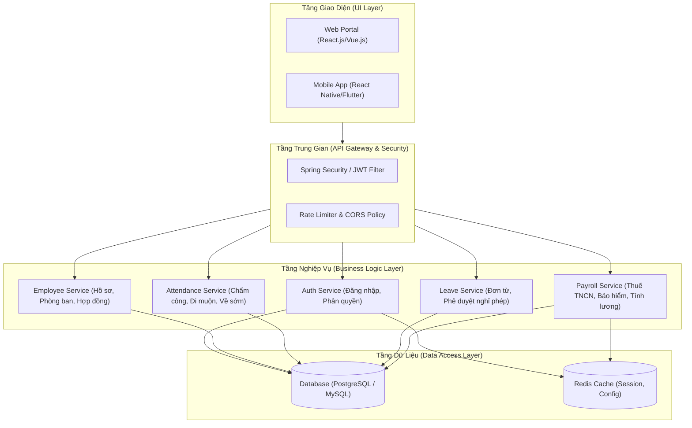
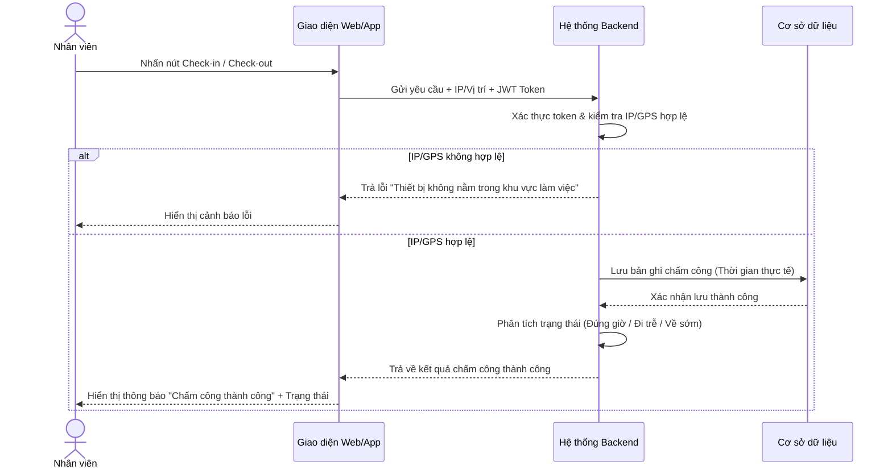
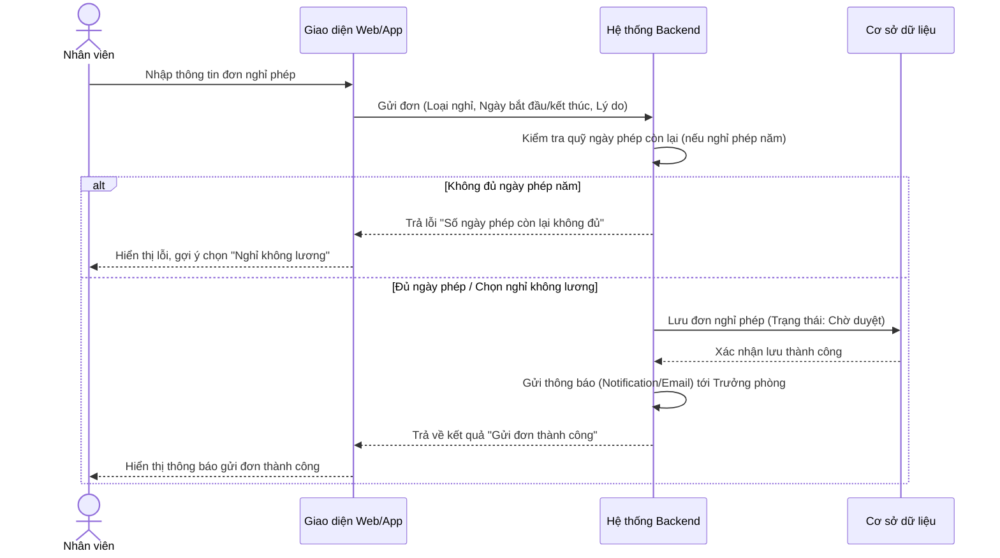
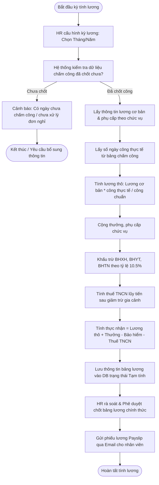
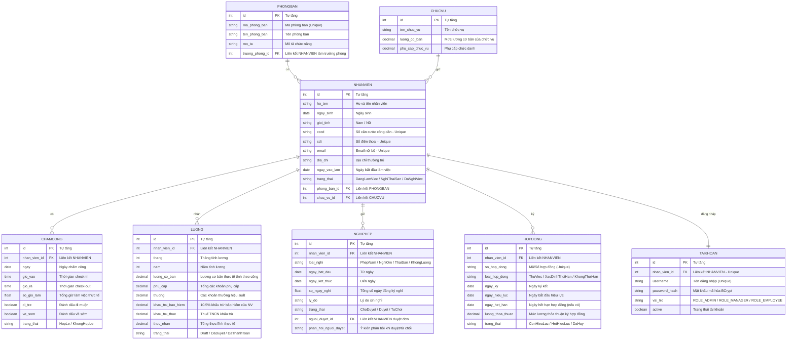

# TÀI LIỆU ĐẶC TẢ YÊU CẦU PHẦN MỀM (SRS)
## HỆ THỐNG QUẢN LÝ NHÂN SỰ TOÀN DIỆN (ADVANCED HRM SYSTEM)

---

### THÔNG TIN TÀI LIỆU (DOCUMENT CONTROL)

| Mục | Chi tiết |
| :--- | :--- |
| **Tên dự án** | Hệ thống Quản lý nhân sự nâng cao (Advanced HRM System) |
| **Mã dự án** | HRM-ADV-2026 |
| **Phiên bản** | 1.1 (Cập nhật chi tiết) |
| **Ngày ban hành** | 09/07/2026 |
| **Tác giả** | Đội ngũ Phát triển Phần mềm |
| **Trạng thái** | Hoàn thành Bản đặc tả chi tiết |

#### Lịch sử thay đổi (Revision History)

| Phiên bản | Ngày | Người thực hiện | Mô tả thay đổi | Trạng thái |
| :--- | :--- | :--- | :--- | :--- |
| **1.0** | 08/07/2026 | BA Team | Khởi tạo tài liệu đặc tả sơ bộ. | Đã duyệt |
| **1.1** | 09/07/2026 | Antigravity AI | Tái cấu trúc tài liệu: Bổ sung chi tiết các Use Case, Quy tắc nghiệp vụ chấm công/lương chi tiết, Từ điển dữ liệu đầy đủ và Yêu cầu phi chức năng cụ thể. | Chờ duyệt |

---

## I. GIỚI THIỆU HỆ THỐNG (INTRODUCTION)

### 1.1 Mục đích
Tài liệu Đặc tả Yêu cầu Phần mềm (SRS) này mô tả chi tiết, toàn diện và đầy đủ các yêu cầu chức năng, phi chức năng, quy tắc nghiệp vụ, cấu trúc cơ sở dữ liệu cũng như luồng xử lý của **Hệ thống Quản lý nhân sự toàn diện (Advanced HRM System)**. 

Tài liệu này đóng vai trò là:
* **Hợp đồng kỹ thuật** giữa khách hàng (Ban lãnh đạo, bộ phận HR) và đội ngũ phát triển.
* **Cơ sở thiết kế chi tiết** cho các kỹ sư phát triển phần mềm (Developers) và kỹ sư thiết kế cơ sở dữ liệu.
* **Tài liệu tham chiếu chính** cho đội ngũ kiểm thử phần mềm (QA/QC) xây dựng kịch bản kiểm thử (Test Cases).
* **Cẩm nang vận hành và nghiệm thu** hệ thống sau khi hoàn thành.

### 1.2 Phạm vi hệ thống
Hệ thống HRM nhằm mục tiêu số hóa và tự động hóa toàn bộ các hoạt động quản lý nhân sự trong doanh nghiệp.

* **Nằm trong phạm vi (In-Scope):**
  * Quản lý hồ sơ nhân viên suốt vòng đời làm việc (từ lúc vào làm cho tới khi nghỉ việc).
  * Quản lý cơ cấu tổ chức (Phòng ban, Chức vụ, Sơ đồ tổ chức).
  * Quản lý chấm công (Check-in/Check-out, ghi nhận giờ công, tính đi muộn/về sớm).
  * Quản lý đơn từ & nghỉ phép (Quy trình xin phép và duyệt nghỉ phép trực tuyến).
  * Quản lý hợp đồng lao động (Thời hạn, ký mới, gia hạn, cảnh báo hết hạn).
  * Quản lý tính lương tự động (Lương cơ bản, phụ cấp, thưởng, các khoản khấu trừ BHXH, thuế TNCN và thực nhận).
  * Phân quyền bảo mật đa cấp (Admin/HR, Trưởng phòng, Nhân viên).
  * Báo cáo thống kê trực quan (Quỹ lương, biến động nhân sự, tỷ lệ đi muộn).
* **Nằm ngoài phạm vi (Out-of-Scope) - Sẽ phát triển ở giai đoạn sau:**
  * Phân hệ Tuyển dụng (Recruitment & Onboarding).
  * Đánh giá hiệu suất nhân sự (KPI, OKR, 360-degree feedback).
  * Quản lý Đào tạo và Phát triển năng lực (L&D - Learning & Development).
  * Tính toán công tác phí và thanh toán trực tiếp qua ngân hàng (Payment Gateway).

### 1.3 Định nghĩa & Từ viết tắt

| Thuật ngữ / Viết tắt | Định nghĩa chi tiết |
| :--- | :--- |
| **HRM** | *Human Resource Management* — Quản lý nguồn nhân lực. |
| **SRS** | *Software Requirements Specification* — Tài liệu đặc tả yêu cầu phần mềm. |
| **Admin / HR** | Quản trị viên hệ thống hoặc Nhân viên phòng Nhân sự — Người có quyền hạn cao nhất. |
| **NV / Trưởng phòng** | Nhân viên thông thường / Quản lý cấp trung phụ trách phòng ban. |
| **BHXH / BHYT / BHTN** | Bảo hiểm xã hội / Bảo hiểm y tế / Bảo hiểm thất nghiệp (Bắt buộc theo Luật lao động Việt Nam). |
| **PIT / Thuế TNCN** | *Personal Income Tax* — Thuế thu nhập cá nhân. |
| **JWT** | *JSON Web Token* — Chuỗi mã hóa dùng để xác thực quyền truy cập API bảo mật. |
| **RBAC** | *Role-Based Access Control* — Cơ chế phân quyền dựa trên vai trò của người dùng. |
| **CCCD** | Căn cước công dân. |
| **ERD** | *Entity Relationship Diagram* — Sơ đồ quan hệ thực thể trong cơ sở dữ liệu. |

---

## II. MÔ TẢ TỔNG QUAN (SYSTEM OVERVIEW)

### 2.1 Tác nhân hệ thống (Actors) & Quyền truy cập
Hệ thống phục vụ ba nhóm đối tượng người dùng chính với các quyền hạn được phân cấp cụ thể dưới đây:

```
                  ┌──────────────────────────────────────────┐
                  │                 ADMIN / HR               │
                  │   - Toàn quyền cấu hình hệ thống         │
                  │   - CRUD Nhân viên, Phòng ban, Chức vụ   │
                  │   - Quản lý Hợp đồng & Tính lương        │
                  └────────────────────┬─────────────────────┘
                                       │
                                       ▼
                  ┌──────────────────────────────────────────┐
                  │               TRƯỞNG PHÒNG               │
                  │   - Xem & Quản lý nhân viên trong phòng  │
                  │   - Phê duyệt đơn nghỉ phép của phòng    │
                  │   - Xem báo cáo năng suất của phòng      │
                  └────────────────────┬─────────────────────┘
                                       │
                                       ▼
                  ┌──────────────────────────────────────────┐
                  │                NHÂN VIÊN                 │
                  │   - Quản lý thông tin cá nhân            │
                  │   - Check-in / Check-out hằng ngày       │
                  │   - Gửi đơn xin nghỉ, xem phiếu lương    │
                  └──────────────────────────────────────────┘
```

### 2.2 Kiến trúc hệ thống (System Architecture)
Hệ thống được phát triển theo mô hình **3 lớp (3-tier Architecture)** tách biệt nhằm đảm bảo tính bảo mật, dễ bảo trì và mở rộng sau này:



---

## III. YÊU CẦU CHỨC NĂNG CHI TIẾT (FUNCTIONAL REQUIREMENTS)

Các yêu cầu chức năng được đánh mã định danh (ID) và gán mức độ ưu tiên theo chuẩn MoSCoW:
* **M** (Must have): Bắt buộc phải có trong phiên bản đầu tiên.
* **S** (Should have): Nên có, rất quan trọng nhưng có thể bổ sung sau một chút.
* **C** (Could have): Có thể có, tính năng tăng cường trải nghiệm.
* **W** (Won't have): Chưa phát triển trong phiên bản này.

### 3.1 Bảng phân tích yêu cầu chức năng

| Yêu cầu ID | Tên chức năng | Mô tả chi tiết | Quyền hạn | Ưu tiên |
| :--- | :--- | :--- | :--- | :--- |
| **FR-1.1** | CRUD Nhân viên | Thêm mới, cập nhật, xóa (hoặc vô hiệu hóa), xem chi tiết thông tin hồ sơ nhân viên. | Admin/HR | **Must** |
| **FR-1.2** | Tìm kiếm & Lọc nhân sự | Tìm kiếm nhanh theo Họ tên, SĐT, Mã nhân viên; Lọc theo Phòng ban, Chức vụ và Trạng thái làm việc. | Admin, Trưởng phòng | **Must** |
| **FR-2.1** | CRUD Phòng ban & Chức vụ | Quản lý danh mục phòng ban (Tên, Mô tả, Trưởng bộ phận) và danh mục chức vụ (Tên, Lương cơ bản, Phụ cấp). | Admin/HR | **Must** |
| **FR-3.1** | Chấm công trực tuyến | Thực hiện Check-in vào đầu ca và Check-out vào cuối ca từ thiết bị cá nhân (kiểm tra giới hạn IP công ty hoặc GPS). | Nhân viên | **Must** |
| **FR-3.2** | Tổng hợp bảng công | Tính toán số giờ làm việc thực tế mỗi ngày, tự động đánh dấu trạng thái: Đi trễ, Về sớm, Nghỉ không phép, Nghỉ phép. | Hệ thống | **Must** |
| **FR-4.1** | Gửi đơn xin nghỉ phép | Chọn loại nghỉ phép (Phép năm, Nghỉ không lương, Ốm đau, Thai sản), chọn khoảng thời gian, nhập lý do và đính kèm minh chứng nếu có. | Nhân viên | **Must** |
| **FR-4.2** | Phê duyệt đơn xin nghỉ | Nhận thông báo đơn nghỉ mới, xem chi tiết lý do và lịch sử nghỉ phép của nhân viên, thực hiện Duyệt hoặc Từ chối kèm ý kiến phản hồi. | Trưởng phòng, HR | **Must** |
| **FR-5.1** | Quản lý Hợp đồng | Lưu trữ hợp đồng lao động của nhân viên. Tự động tính toán ngày hiệu lực và ngày hết hạn hợp đồng. | Admin/HR | **Should** |
| **FR-5.2** | Cảnh báo hết hạn hợp đồng | Gửi email thông báo cho phòng HR trước 30 ngày đối với các hợp đồng lao động sắp hết hạn. | Hệ thống | **Should** |
| **FR-6.1** | Cấu hình kỳ công & lương | Thiết lập số ngày công chuẩn trong tháng (ví dụ: 26 ngày) và cấu hình các tỷ lệ bảo hiểm, giảm trừ gia cảnh. | Admin/HR | **Must** |
| **FR-6.2** | Tính toán bảng lương tháng | Tự động tính lương chi tiết cho toàn bộ nhân sự dựa trên ngày công thực tế, phụ cấp chức vụ, thưởng, phạt và các khoản khấu trừ thuế, bảo hiểm. | Hệ thống / HR | **Must** |
| **FR-6.3** | Xuất phiếu lương (Payslip) | Xuất file PDF phiếu lương cá nhân và gửi tự động qua email của nhân viên. Cho phép nhân viên xem phiếu lương trực tuyến. | Nhân viên, HR | **Should** |
| **FR-7.1** | Báo cáo thống kê | Biểu đồ trực quan về cơ cấu nhân sự, biến động số lượng nhân viên theo tháng, tổng quỹ lương chi trả thực tế. | Admin/HR, Trưởng phòng | **Should** |

---

## IV. ĐẶC TẢ CHI TIẾT CÁC USE CASE CORE (USE CASE SPECIFICATIONS)

### 4.1 Use Case 1: Chấm công hằng ngày (Check-in / Check-out)



#### Mô tả chi tiết Use Case 1:
* **Tác nhân chính:** Nhân viên.
* **Tiền điều kiện:** Nhân viên đã đăng nhập tài khoản thành công, tài khoản ở trạng thái hoạt động (Active). Thiết bị kết nối Internet của nhân viên phải sử dụng địa chỉ IP thuộc dải IP cho phép của công ty (hoặc tọa độ GPS nằm trong bán kính 100m của văn phòng).
* **Luồng xử lý chính (Basic Flow):**
  1. Nhân viên truy cập vào phân hệ Chấm công trên giao diện.
  2. Hệ thống hiển thị thời gian hiện tại của máy chủ và nút chức năng tương ứng (**Check-in** vào đầu ca hoặc **Check-out** vào cuối ca).
  3. Nhân viên nhấn nút thực hiện.
  4. Hệ thống tự động thu thập địa chỉ IP mạng (hoặc tọa độ GPS) của thiết bị nhân viên gửi về máy chủ.
  5. Hệ thống xác thực vị trí: hợp lệ.
  6. Hệ thống ghi nhận mốc thời gian thực tế vào bảng `CHAMCONG`.
  7. Hệ thống so sánh mốc thời gian thực tế với cấu hình ca làm việc để phân loại trạng thái (Đúng giờ, Đi trễ, Về sớm) và hiển thị kết quả cho nhân viên.
* **Luồng ngoại lệ (Exceptions):**
  * **Vị trí không hợp lệ:** Tại bước 5, nếu IP hoặc tọa độ GPS nằm ngoài phạm vi cho phép, hệ thống từ chối ghi nhận công, hiển thị thông báo lỗi: *"Bạn không ở văn phòng làm việc, không thể chấm công!"*.
  * **Trùng lặp thao tác:** Nếu nhân viên nhấn Check-in/Check-out liên tiếp trong vòng 1 phút, hệ thống bỏ qua các yêu cầu phía sau để tránh ghi nhận rác.

---

### 4.2 Use Case 2: Gửi đơn xin nghỉ phép (Submit Leave Request)



#### Mô tả chi tiết Use Case 2:
* **Tác nhân chính:** Nhân viên.
* **Tiền điều kiện:** Nhân viên đã đăng nhập thành công.
* **Luồng xử lý chính (Basic Flow):**
  1. Nhân viên chọn chức năng "Tạo đơn xin nghỉ phép".
  2. Nhân viên điền thông tin: Loại nghỉ phép (Nghỉ phép năm, Nghỉ không lương, Nghỉ ốm đau...), từ ngày, đến ngày, số ngày nghỉ và lý do chi tiết.
  3. Nhân viên nhấn nút **Gửi đơn**.
  4. Hệ thống kiểm tra điều kiện nghiệp vụ: Nếu là "Nghỉ phép năm", hệ thống đối chiếu số ngày xin nghỉ với số ngày phép còn lại của nhân viên trong năm hiện tại.
  5. Nếu thỏa mãn điều kiện, hệ thống lưu bản ghi vào bảng `NGHIPHEP` với trạng thái mặc định là `ChoDuyet` (Chờ duyệt).
  6. Hệ thống gửi thông báo đẩy (Notification) và Email tự động tới Trưởng phòng phụ trách phòng ban của nhân viên đó.
* **Luồng ngoại lệ (Exceptions):**
  * **Vượt quá số ngày phép còn lại:** Tại bước 4, nếu số ngày xin nghỉ phép lớn hơn quỹ ngày phép năm còn lại, hệ thống sẽ chặn không cho gửi đơn và hiển thị thông báo: *"Số ngày phép năm còn lại của bạn không đủ (Còn X ngày). Hãy chuyển sang hình thức Nghỉ không lương!"*.
  * **Trùng lịch nghỉ:** Nếu khoảng thời gian xin nghỉ trùng với một đơn nghỉ khác đã được phê duyệt trước đó, hệ thống sẽ báo lỗi trùng lịch.

---

### 4.3 Use Case 3: Phê duyệt đơn xin nghỉ phép (Approve/Reject Leave Request)

* **Tác nhân chính:** Trưởng phòng (hoặc nhân viên Admin/HR).
* **Tiền điều kiện:** Đã đăng nhập vào hệ thống với vai trò Trưởng phòng hoặc Admin/HR. Có đơn xin nghỉ phép của nhân viên thuộc cấp quản lý đang ở trạng thái `ChoDuyet`.
* **Luồng xử lý chính (Basic Flow):**
  1. Người quản lý truy cập phân hệ "Danh sách đơn cần duyệt".
  2. Hệ thống hiển thị danh sách đơn kèm theo thông tin chi tiết của nhân viên gửi đơn, loại nghỉ, lý do, số ngày nghỉ phép còn lại của nhân viên đó.
  3. Người quản lý chọn đơn cần xử lý và nhấn **Phê duyệt (Approve)** hoặc **Từ chối (Reject)**, đồng thời nhập ý kiến phản hồi (bắt buộc nhập nếu từ chối).
  4. Hệ thống cập nhật trạng thái đơn trong cơ sở dữ liệu (`Duyet` hoặc `TuChoi`).
  5. **Nếu đơn được phê duyệt và loại nghỉ là "Nghỉ phép năm":** Hệ thống tự động trừ số ngày phép tương ứng vào quỹ phép năm của nhân viên đó.
  6. Hệ thống gửi thông báo kết quả phê duyệt cho nhân viên qua email và Notification trong ứng dụng.
* **Luồng ngoại lệ (Exceptions):**
  * **Đơn đã được xử lý:** Nếu Trưởng phòng khác hoặc HR đã xử lý đơn này trước đó (trạng thái đã chuyển sang `Duyet` hoặc `TuChoi`), hệ thống hiển thị thông báo: *"Đơn này đã được xử lý bởi người khác!"* và làm mới lại danh sách.

---

### 4.4 Use Case 4: Tính lương hàng tháng (Calculate Monthly Payroll)



#### Mô tả chi tiết Use Case 4:
* **Tác nhân chính:** Admin/HR.
* **Tiền điều kiện:** Đã chốt dữ liệu chấm công và phê duyệt toàn bộ đơn nghỉ phép trong tháng tính lương.
* **Luồng xử lý chính (Basic Flow):**
  1. Nhân viên HR truy cập phân hệ "Tính lương hằng tháng".
  2. HR chọn Kỳ lương (Tháng/Năm) và số Ngày công chuẩn của tháng (mặc định là 26 ngày).
  3. HR nhấn nút **Tính lương**.
  4. Hệ thống tự động truy vấn dữ liệu chấm công của toàn bộ nhân viên hoạt động trong tháng đó để xác định: Số ngày đi làm thực tế, số ngày nghỉ phép hưởng lương, số ngày nghỉ không lương, số lần đi muộn/về sớm.
  5. Hệ thống lấy thông tin cấu hình lương cơ bản và phụ cấp hiện tại từ chức vụ của mỗi nhân viên.
  6. Hệ thống áp dụng công thức tính lương, tính toán các khoản đóng bảo hiểm (10.5%) và thuế TNCN theo quy định của pháp luật Việt Nam (Chi tiết tại Mục VII - Quy tắc nghiệp vụ).
  7. Hệ thống hiển thị bảng lương tổng hợp dưới dạng dự thảo (Draft) để HR kiểm tra.
  8. HR rà soát các số liệu. Nếu chính xác, HR nhấn **Xác nhận & Chốt bảng lương**.
  9. Hệ thống cập nhật trạng thái bảng lương thành chính thức, tự động tạo phiếu lương (Payslip) dạng PDF gửi qua email cho từng nhân viên và mở quyền xem phiếu lương trên ứng dụng cá nhân.

---

## V. MÔ HÌNH DỮ LIỆU & THIẾT KẾ CƠ SỞ DỮ LIỆU (DATABASE SCHEMA)

### 5.1 Sơ đồ mối quan hệ thực thể (ERD)



### 5.2 Từ điển dữ liệu chi tiết (Data Dictionary)

#### 5.2.1 Bảng `PHONGBAN` (Quản lý Phòng Ban)
*Lưu trữ danh sách các phòng ban chức năng trong tổ chức.*

| Tên trường | Kiểu dữ liệu | Ràng buộc | Mô tả |
| :--- | :--- | :--- | :--- |
| `id` | INT | PK, Auto Increment | Khóa chính của bảng. |
| `ma_phong_ban` | VARCHAR(20) | UNIQUE, NOT NULL | Mã phòng ban định danh (ví dụ: HR, IT, MKT, ACC). |
| `ten_phong_ban` | VARCHAR(100) | NOT NULL | Tên đầy đủ của phòng ban (ví dụ: Phòng Nhân sự). |
| `mo_ta` | TEXT | NULLABLE | Mô tả chi tiết về chức năng, nhiệm vụ phòng ban. |
| `truong_phong_id` | INT | FK -> `NHANVIEN(id)`, NULLABLE | ID của nhân viên giữ chức vụ Trưởng phòng. |

#### 5.2.2 Bảng `CHUCVU` (Quản lý Chức Vụ & Định Mức Lương)
*Quản lý danh mục chức vụ và làm căn cứ xác định mức lương sàn.*

| Tên trường | Kiểu dữ liệu | Ràng buộc | Mô tả |
| :--- | :--- | :--- | :--- |
| `id` | INT | PK, Auto Increment | Khóa chính. |
| `ten_chuc_vu` | VARCHAR(100) | NOT NULL | Tên chức vụ (ví dụ: Lập trình viên, Trưởng phòng IT). |
| `luong_co_ban` | DECIMAL(15,2) | NOT NULL, >= 0 | Mức lương cơ bản quy định cho chức vụ này (VNĐ). |
| `phu_cap_chuc_vu`| DECIMAL(15,2) | NOT NULL, >= 0 | Phụ cấp cố định theo chức vụ (VNĐ). |

#### 5.2.3 Bảng `NHANVIEN` (Hồ Sơ Nhân Viên)
*Bảng trung tâm lưu giữ lý lịch trích ngang của nhân viên.*

| Tên trường | Kiểu dữ liệu | Ràng buộc | Mô tả |
| :--- | :--- | :--- | :--- |
| `id` | INT | PK, Auto Increment | Khóa chính, mã số nhân viên nội bộ. |
| `ho_ten` | VARCHAR(100) | NOT NULL | Họ và tên đầy đủ (ví dụ: Nguyễn Văn A). |
| `ngay_sinh` | DATE | NOT NULL | Ngày tháng năm sinh (đảm bảo đủ tuổi lao động). |
| `gioi_tinh` | VARCHAR(10) | NOT NULL | Giới tính (Nam, Nữ, Khác). |
| `cccd` | VARCHAR(20) | UNIQUE, NOT NULL | Số căn cước công dân để đóng bảo hiểm & thuế. |
| `sdt` | VARCHAR(15) | UNIQUE, NOT NULL | Số điện thoại liên lạc cá nhân. |
| `email` | VARCHAR(100) | UNIQUE, NOT NULL | Email công ty cấp (ví dụ: anv@company.com). |
| `dia_chi` | VARCHAR(255) | NULLABLE | Địa chỉ thường trú hoặc tạm trú hiện tại. |
| `ngay_vao_lam` | DATE | NOT NULL | Ngày chính thức ký hợp đồng nhận việc. |
| `trang_thai` | VARCHAR(20) | NOT NULL | Trạng thái: `DangLamViec`, `NghiThaiSan`, `DaNghiViec`. |
| `phong_ban_id` | INT | FK -> `PHONGBAN(id)` | Liên kết tới phòng ban nhân viên đang trực thuộc. |
| `chuc_vu_id` | INT | FK -> `CHUCVU(id)` | Liên kết tới chức vụ nhân viên đang nắm giữ. |

#### 5.2.4 Bảng `CHAMCONG` (Nhật Ký Chấm Công Hằng Ngày)
*Lưu nhật ký chấm công vào/ra để làm căn cứ tính công.*

| Tên trường | Kiểu dữ liệu | Ràng buộc | Mô tả |
| :--- | :--- | :--- | :--- |
| `id` | INT | PK, Auto Increment | Khóa chính. |
| `nhan_vien_id` | INT | FK -> `NHANVIEN(id)`, NOT NULL | Nhân viên thực hiện chấm công. |
| `ngay` | DATE | NOT NULL | Ngày chấm công (Định dạng YYYY-MM-DD). |
| `gio_vao` | TIME | NULLABLE | Giờ check-in thực tế. |
| `gio_ra` | TIME | NULLABLE | Giờ check-out thực tế. |
| `so_gio_lam` | FLOAT | DEFAULT 0.0 | Tổng thời gian làm việc trong ngày (tính bằng giờ). |
| `di_tre` | BOOLEAN | DEFAULT FALSE | TRUE nếu check-in muộn hơn giờ quy định. |
| `ve_som` | BOOLEAN | DEFAULT FALSE | TRUE nếu check-out sớm hơn giờ quy định. |
| `trang_thai` | VARCHAR(20) | NOT NULL | Trạng thái: `HopLe` (vị trí đúng), `KhongHopLe`. |

#### 5.2.5 Bảng `NGHIPHEP` (Đơn Xin Nghỉ Phép)
*Theo dõi thông tin xin nghỉ và tiến trình duyệt đơn xin nghỉ.*

| Tên trường | Kiểu dữ liệu | Ràng buộc | Mô tả |
| :--- | :--- | :--- | :--- |
| `id` | INT | PK, Auto Increment | Khóa chính. |
| `nhan_vien_id` | INT | FK -> `NHANVIEN(id)`, NOT NULL | Nhân viên làm đơn xin nghỉ. |
| `loai_nghi` | VARCHAR(30) | NOT NULL | Loại nghỉ: `PhepNam`, `NghiOm`, `ThaiSan`, `KhongLuong`. |
| `ngay_bat_dau` | DATE | NOT NULL | Ngày đầu tiên bắt đầu nghỉ. |
| `ngay_ket_thuc` | DATE | NOT NULL | Ngày cuối cùng của kỳ nghỉ. |
| `so_ngay_nghi` | FLOAT | NOT NULL | Tổng số ngày xin nghỉ (có thể là 0.5 nếu nghỉ nửa ngày). |
| `ly_do` | TEXT | NOT NULL | Lý do chi tiết xin nghỉ phép. |
| `trang_thai` | VARCHAR(20) | NOT NULL, DEFAULT 'ChoDuyet'| Trạng thái đơn: `ChoDuyet`, `Duyet`, `TuChoi`. |
| `nguoi_duyet_id` | INT | FK -> `NHANVIEN(id)`, NULLABLE | Cấp quản lý trực tiếp phê duyệt đơn này. |
| `phan_hoi_nguoi_duyet`| TEXT | NULLABLE | Ghi chú phản hồi lý do từ chối hoặc yêu cầu làm rõ. |

#### 5.2.6 Bảng `HOPDONG` (Hợp Đồng Lao Động)
*Lưu trữ hợp đồng lao động để giám sát thời hạn làm việc và bảo hiểm.*

| Tên trường | Kiểu dữ liệu | Ràng buộc | Mô tả |
| :--- | :--- | :--- | :--- |
| `id` | INT | PK, Auto Increment | Khóa chính. |
| `nhan_vien_id` | INT | FK -> `NHANVIEN(id)`, NOT NULL | Nhân viên sở hữu hợp đồng. |
| `so_hop_dong` | VARCHAR(50) | UNIQUE, NOT NULL | Số hiệu hợp đồng (ví dụ: 124/2026/HDLD-ABC). |
| `loai_hop_dong` | VARCHAR(30) | NOT NULL | Loại hợp đồng: `ThuViec`, `XacDinhThoiHan`, `KhongThoiHan`. |
| `ngay_ky` | DATE | NOT NULL | Ngày các bên ký kết hợp đồng. |
| `ngay_hieu_luc` | DATE | NOT NULL | Ngày hợp đồng bắt đầu có giá trị pháp lý. |
| `ngay_het_han` | DATE | NULLABLE | Ngày kết thúc hợp đồng (để trống nếu không xác định thời hạn). |
| `luong_thoa_thuan`| DECIMAL(15,2) | NOT NULL | Mức lương ghi trên hợp đồng dùng để đóng bảo hiểm. |
| `trang_thai` | VARCHAR(20) | NOT NULL | Trạng thái: `ConHieuLuc`, `HetHieuLuc`, `DaHuy`. |

#### 5.2.7 Bảng `LUONG` (Bảng Lương Tháng Chi Tiết)
*Kết quả tính toán lương cuối kỳ cho từng nhân sự.*

| Tên trường | Kiểu dữ liệu | Ràng buộc | Mô tả |
| :--- | :--- | :--- | :--- |
| `id` | INT | PK, Auto Increment | Khóa chính. |
| `nhan_vien_id` | INT | FK -> `NHANVIEN(id)`, NOT NULL | Nhân viên nhận lương. |
| `thang` | INT | NOT NULL (1 - 12) | Tháng tính lương. |
| `nam` | INT | NOT NULL | Năm tính lương. |
| `luong_co_ban` | DECIMAL(15,2) | NOT NULL | Lương cơ bản tính theo số ngày công đi làm thực tế. |
| `phu_cap` | DECIMAL(15,2) | NOT NULL, DEFAULT 0.00| Tổng phụ cấp được nhận trong tháng. |
| `thuong` | DECIMAL(15,2) | NOT NULL, DEFAULT 0.00| Thưởng hiệu suất, thưởng chuyên cần, lễ tết. |
| `khau_tru_bao_hiem`| DECIMAL(15,2)| NOT NULL | Khoản tiền 10.5% lương đóng bảo hiểm trích từ lương NV. |
| `khau_tru_thue` | DECIMAL(15,2) | NOT NULL | Thuế thu nhập cá nhân bị khấu trừ. |
| `thuc_nhan` | DECIMAL(15,2) | NOT NULL | Tiền thực tế chuyển khoản vào tài khoản nhân viên. |
| `trang_thai` | VARCHAR(20) | NOT NULL | Trạng thái thanh toán: `Draft`, `DaDuyet`, `DaThanhToan`. |

#### 5.2.8 Bảng `TAIKHOAN` (Thông Tin Đăng Nhập & Phân Quyền)
*Lưu thông tin tài khoản đăng nhập hệ thống của nhân viên.*

| Tên trường | Kiểu dữ liệu | Ràng buộc | Mô tả |
| :--- | :--- | :--- | :--- |
| `id` | INT | PK, Auto Increment | Khóa chính. |
| `nhan_vien_id` | INT | FK -> `NHANVIEN(id)`, UNIQUE | Một nhân viên chỉ có tối đa một tài khoản hệ thống. |
| `username` | VARCHAR(50) | UNIQUE, NOT NULL | Tên đăng nhập (ví dụ: mã nhân viên hoặc email). |
| `password_hash` | VARCHAR(255) | NOT NULL | Mật khẩu đã được mã hóa bằng thuật toán BCrypt. |
| `vai_tro` | VARCHAR(30) | NOT NULL | Vai trò phân quyền: `ROLE_ADMIN`, `ROLE_MANAGER`, `ROLE_EMPLOYEE`. |
| `active` | BOOLEAN | NOT NULL, DEFAULT TRUE | Trạng thái kích hoạt. Nếu nghỉ việc sẽ chuyển thành FALSE. |

---

## VI. QUY TẮC NGHIỆP VỤ HỆ THỐNG (BUSINESS RULES)

### 6.1 Quy tắc Chấm công (Attendance Policy)

* **Giờ làm việc hành chính chuẩn:**
  * **Ca sáng:** 08:00 – 12:00 (Check-in trước 08:00, Check-out sau 12:00).
  * **Nghỉ trưa:** 12:00 – 13:30.
  * **Ca chiều:** 13:30 – 17:30 (Check-in trước 13:30, Check-out sau 17:30).
  * *Tổng thời gian làm việc tiêu chuẩn một ngày: 8.0 giờ.*
* **Thời gian ân hạn đi muộn (Grace Period):**
  * Nhân viên được phép đi muộn tối đa **15 phút** vào đầu giờ sáng (đến 08:15) mà không bị phạt hành chính (nhưng hệ thống vẫn lưu chính xác giờ check-in thực tế).
  * Nếu check-in sau 08:15, hệ thống sẽ đánh dấu `di_tre = TRUE`.
* **Quy tắc phạt đi muộn / về sớm:**
  * Đi muộn/về sớm dưới 30 phút: Trừ 1/8 ngày công (tương đương 1 tiếng làm việc).
  * Đi muộn/về sớm từ 30 phút đến dưới 2 tiếng: Trừ 1/2 ngày công.
  * Đi muộn/về sớm trên 2 tiếng: Tính là nghỉ không phép nửa ngày.

### 6.2 Quy tắc Nghỉ phép (Leave Policy)

* **Ngày phép năm định mức:**
  * Nhân viên chính thức ký hợp đồng từ 1 năm trở lên được hưởng **12 ngày phép năm** hưởng lương/năm (tương ứng mỗi tháng làm việc đầy đủ được cộng thêm 1 ngày phép).
  * Số ngày phép năm chưa sử dụng hết trong năm sẽ được bảo lưu và cộng dồn sang năm sau tối đa đến hết ngày 31/03 của năm kế tiếp.
* **Thời hạn gửi đơn xin nghỉ:**
  * Đơn xin nghỉ dưới 2 ngày: Gửi trước ngày nghỉ ít nhất **24 giờ**.
  * Đơn xin nghỉ từ 3 ngày đến dưới 5 ngày: Gửi trước ít nhất **5 ngày làm việc**.
  * Đơn xin nghỉ từ 5 ngày trở lên hoặc nghỉ phép dài hạn: Gửi trước ít nhất **15 ngày**.
  * *Trường hợp khẩn cấp (tai nạn, ốm đau đột xuất): Cho phép nộp bổ sung giấy tờ bệnh viện trong vòng 48 giờ sau khi đi làm lại.*

### 6.3 Quy tắc Tính Lương & Thuế Chi Tiết (Payroll Rules)

#### 6.3.1 Công thức tính lương cơ bản thực nhận
Số tiền lương cơ bản thực nhận trong tháng của nhân viên được tính dựa trên số ngày công làm việc thực tế đối chiếu với ngày công chuẩn cấu hình của tháng đó:

$$\text{Lương cơ bản thực nhận} = \frac{\text{Lương thỏa thuận trên HĐ}}{\text{Ngày công chuẩn của tháng}} \times \text{Ngày công thực tế}$$

*Trong đó:*
* **Ngày công thực tế** = (Số ngày đi làm đủ ca) + (Số ngày nghỉ phép năm hưởng lương) + (0.5 x Số ngày làm nửa ca hoặc đi muộn/về sớm bị phạt).
* **Ngày công chuẩn:** Do HR cấu hình theo lịch làm việc thực tế từng tháng (thường dao động từ 24 - 26 ngày, loại trừ các ngày Chủ nhật hoặc ngày nghỉ Lễ/Tết pháp luật quy định).

#### 6.3.2 Quy tắc khấu trừ bảo hiểm bắt buộc
Tỷ lệ trích đóng các khoản bảo hiểm bắt buộc khấu trừ vào lương của nhân viên theo Luật Lao động Việt Nam hiện hành được quy định như sau:

| Loại bảo hiểm | Tỷ lệ trích đóng từ lương Nhân viên | Tỷ lệ Công ty đóng (Không trừ lương NV) | Tổng tỷ lệ đóng bảo hiểm |
| :--- | :--- | :--- | :--- |
| **Bảo hiểm Xã hội (BHXH)** | **8.0%** | 17.5% | 25.5% |
| **Bảo hiểm Y tế (BHYT)** | **1.5%** | 3.0% | 4.5% |
| **Bảo hiểm Thất nghiệp (BHTN)**| **1.0%** | 1.0% | 2.0% |
| **TỔNG KHẤU TRỪ** | **10.5%** | **21.5%** | **32.0%** |

*Lưu ý:* Mức lương làm căn cứ đóng bảo hiểm tối đa không được vượt quá 20 lần mức lương cơ sở do nhà nước quy định.

#### 6.3.3 Quy tắc tính thuế thu nhập cá nhân (PIT)
Quy trình tính thuế thu nhập cá nhân (TNCN) của nhân viên được thực hiện tự động qua các bước sau:

**Bước 1: Tính thu nhập chịu thuế (Taxable Income)**
$$\text{Thu nhập chịu thuế} = \text{Tổng thu nhập trong tháng} - \text{Các khoản phụ cấp được miễn thuế (như ăn trưa, điện thoại)}$$

**Bước 2: Tính thu nhập tính thuế (Taxable Income after deductions)**
$$\text{Thu nhập tính thuế} = \text{Thu nhập chịu thuế} - \text{Các khoản bảo hiểm bắt buộc (10.5%)} - \text{Các khoản giảm trừ gia cảnh}$$

*Mức giảm trừ gia cảnh áp dụng theo quy định hiện hành:*
* **Giảm trừ bản thân người nộp thuế:** 11,000,000 VNĐ/tháng.
* **Giảm trừ người phụ thuộc (con nhỏ, bố mẹ già yếu không có thu nhập):** 4,400,000 VNĐ/người/tháng (nhân viên phải đăng ký minh chứng được HR duyệt).

**Bước 3: Áp dụng biểu thuế lũy tiến từng phần để tính số thuế phải nộp:**

| Bậc | Phần thu nhập tính thuế / tháng (VNĐ) | Thuế suất | Công thức tính nhanh |
| :--- | :--- | :---: | :--- |
| **1** | Đến 5,000,000 | 5% | $\text{Thu nhập tính thuế} \times 5\%$ |
| **2** | Trên 5,000,000 đến 10,000,000 | 10% | $(\text{Thu nhập tính thuế} \times 10\%) - 250,000$ |
| **3** | Trên 10,000,000 đến 18,000,000 | 15% | $(\text{Thu nhập tính thuế} \times 15\%) - 750,000$ |
| **4** | Trên 18,000,000 đến 32,000,000 | 20% | $(\text{Thu nhập tính thuế} \times 20\%) - 1,650,000$ |
| **5** | Trên 32,000,000 đến 52,000,000 | 25% | $(\text{Thu nhập tính thuế} \times 25\%) - 3,250,000$ |
| **6** | Trên 52,000,000 đến 80,000,000 | 30% | $(\text{Thu nhập tính thuế} \times 30\%) - 5,850,000$ |
| **7** | Trên 80,000,000 | 35% | $(\text{Thu nhập tính thuế} \times 35\%) - 9,850,000$ |

---

## VII. YÊU CẦU PHI CHỨC NĂNG (NON-FUNCTIONAL REQUIREMENTS)

### 7.1 Yêu cầu về Hiệu năng (Performance)
* **Thời gian phản hồi (Response Time):** 
  * Các thao tác xem danh sách, check-in, check-out, lưu biểu mẫu thông thường phải có thời gian phản hồi API dưới **500ms** trong điều kiện mạng bình thường.
  * Tác vụ tính toán lương hàng tháng cho toàn bộ công ty (< 500 nhân sự) phải hoàn thành trong vòng **5 giây**.
  * Xuất báo cáo thống kê hoặc xuất file PDF Payslip hàng loạt phải hoàn thành trong vòng **10 giây**.
* **Khả năng chịu tải (Scalability & Concurrency):**
  * Hệ thống hỗ trợ tối thiểu **100 người dùng hoạt động đồng thời (Concurrent Users)** mà không xảy ra hiện tượng nghẽn hoặc sập hệ thống.
  * Đặc biệt vào các khung giờ cao điểm chấm công (07:45 - 08:05 và 17:30 - 17:45), hệ thống phải chịu được tần suất gửi yêu cầu chấm công cao mà không làm mất mát dữ liệu công.

### 7.2 Yêu cầu về Bảo mật (Security)
* **Xác thực và Phân quyền:**
  * Mọi thông tin trao đổi giữa Client và Server phải được mã hóa bằng giao thức **HTTPS (TLS 1.3)**.
  * Xác thực người dùng thông qua cơ chế **JWT (JSON Web Token)**. Token được lưu trữ an toàn ở client (HttpOnly Cookie để chống tấn công XSS). Token có thời gian hết hạn là **12 giờ**.
  * Phân quyền truy cập tài nguyên chặt chẽ bằng cơ chế **RBAC** ở tầng Backend (Spring Security). Nhân viên tuyệt đối không thể gọi các API quản lý lương hay hồ sơ của nhân viên khác.
* **Bảo vệ dữ liệu:**
  * Mật khẩu người dùng bắt buộc phải được mã hóa một chiều bằng thuật toán **BCrypt** với độ muối (Strength factor) từ 10 trở lên trước khi lưu vào cơ sở dữ liệu.
  * Các dữ liệu nhạy cảm của nhân sự như: số CCCD, số tài khoản ngân hàng, thông tin lương thỏa thuận phải được mã hóa trước khi lưu trữ trong Database nhằm đề phòng rò rỉ dữ liệu khi CSDL bị tấn công.
  * Phòng chống triệt để các lỗ hổng bảo mật phổ biến như SQL Injection, Cross-Site Scripting (XSS), CSRF và Broken Object Level Authorization (BOLA).

### 7.3 Yêu cầu về Độ tin cậy & Vận hành (Reliability & Availability)
* **Độ sẵn sàng (Availability):** Hệ thống hoạt động liên tục với cam kết thời gian hoạt động tối thiểu đạt **99.9%** (Uptime 24/7/365), trừ những khoảng thời gian bảo trì định kỳ được thông báo trước.
* **Phương án Sao lưu dữ liệu (Backup Strategy):**
  * Tự động sao lưu cơ sở dữ liệu (Full Database Backup) vào lúc **02:00 AM hằng ngày** và đẩy lên phân vùng lưu trữ đám mây tách biệt (AWS S3 hoặc Google Cloud Storage).
  * Lưu trữ lịch sử backup tối thiểu **30 ngày gần nhất** để phục vụ khôi phục khi gặp sự cố.
* **Thời gian phục hồi khi có sự cố:**
  * Chỉ số RTO (Recovery Time Objective) dưới **2 giờ** để khôi phục hệ thống hoạt động bình thường.
  * Chỉ số RPO (Recovery Point Objective) dưới **24 giờ** (đảm bảo mất mát dữ liệu không quá mốc backup của ngày gần nhất).

---

## VIII. DANH SÁCH CÁC API ENDPOINTS CORE (DỰ KIẾN)

Dưới đây là một số API cốt lõi phục vụ các chức năng nghiệp vụ trọng tâm đã được mô hình hóa:

### 8.1 API Đăng nhập và Xác thực (`/api/v1/auth`)

* **`POST /api/v1/auth/login`**
  * *Mô tả:* Xác thực tài khoản nhân viên và trả về token JWT cùng thông tin quyền hạn cơ bản.
  * *Request Body:*
    ```json
    {
      "username": "nv.nguyenwana",
      "password": "SecurePassword123!"
    }
    ```
  * *Response (Success - 200 OK):*
    ```json
    {
      "success": true,
      "message": "Đăng nhập thành công",
      "data": {
        "accessToken": "eyJhbGciOiJIUzI1NiIsInR5cCI6IkpXVCJ9...",
        "tokenType": "Bearer",
        "expiresIn": 43200,
        "userInfo": {
          "id": 15,
          "username": "nv.nguyenwana",
          "hoTen": "Nguyễn Văn A",
          "email": "anv@company.com",
          "vaiTro": "ROLE_EMPLOYEE"
        }
      }
    }
    ```

### 8.2 API Chấm công (`/api/v1/attendance`)

* **`POST /api/v1/attendance/check-in`**
  * *Mô tả:* Thực hiện check-in đầu ca làm việc của nhân viên đang đăng nhập.
  * *Request Headers:* `Authorization: Bearer <token>`
  * *Request Body (Gửi tọa độ GPS nếu dùng thiết bị di động):*
    ```json
    {
      "latitude": 21.028511,
      "longitude": 105.804817
    }
    ```
  * *Response (Success - 200 OK):*
    ```json
    {
      "success": true,
      "message": "Ghi nhận Check-in thành công",
      "data": {
        "id": 3452,
        "ngay": "2026-07-09",
        "gioVao": "08:05:23",
        "diTre": false,
        "trangThai": "HopLe"
      }
    }
    ```

* **`POST /api/v1/attendance/check-out`**
  * *Mô tả:* Thực hiện check-out cuối ca làm việc.
  * *Response (Success - 200 OK):*
    ```json
    {
      "success": true,
      "message": "Ghi nhận Check-out thành công",
      "data": {
        "id": 3452,
        "ngay": "2026-07-09",
        "gioVao": "08:05:23",
        "gioRa": "17:32:10",
        "soGioLam": 8.0,
        "veSom": false,
        "trangThai": "HopLe"
      }
    }
    ```

### 8.3 API Nghỉ phép (`/api/v1/leaves`)

* **`POST /api/v1/leaves/request`**
  * *Mô tả:* Nhân viên gửi đơn xin nghỉ phép trực tuyến.
  * *Request Body:*
    ```json
    {
      "loaiNghi": "PhepNam",
      "ngayBatDau": "2026-07-15",
      "ngayKetThuc": "2026-07-16",
      "soNgayNghi": 2.0,
      "lyDo": "Giải quyết công việc gia đình ở quê"
    }
    ```
  * *Response (Success - 201 Created):*
    ```json
    {
      "success": true,
      "message": "Gửi đơn xin nghỉ phép thành công, đang chờ phê duyệt",
      "data": {
        "id": 876,
        "nhanVienId": 15,
        "loaiNghi": "PhepNam",
        "ngayBatDau": "2026-07-15",
        "ngayKetThuc": "2026-07-16",
        "soNgayNghi": 2.0,
        "trangThai": "ChoDuyet"
      }
    }
    ```

* **`PUT /api/v1/leaves/approve/{id}`**
  * *Mô tả:* Quản lý duyệt hoặc từ chối đơn xin nghỉ phép của cấp dưới.
  * *Request Headers:* `Authorization: Bearer <token_truong_phong>`
  * *Request Body:*
    ```json
    {
      "duyet": true,
      "phanHoi": "Đã duyệt, bàn giao công việc đầy đủ cho nhóm trước khi nghỉ."
    }
    ```
  * *Response (Success - 200 OK):*
    ```json
    {
      "success": true,
      "message": "Đã phê duyệt đơn nghỉ phép thành công",
      "data": {
        "id": 876,
        "trangThai": "Duyet",
        "nguoiDuyetId": 3,
        "phanHoiNguoiDuyet": "Đã duyệt, bàn giao công việc đầy đủ cho nhóm trước khi nghỉ."
      }
    }
    ```

---

## IX. ĐIỀU KHOẢN NGHIỆM THU & PHÊ DUYỆT (APPROVALS)

Hệ thống được coi là hoàn tất giai đoạn phát triển và đủ điều kiện nghiệm thu bàn giao khi đáp ứng đầy đủ các tiêu chuẩn sau:
1. Vượt qua **100% các kịch bản kiểm thử (Test Cases)** mức độ nghiêm trọng (Critical & Major) được thiết lập dựa trên tài liệu này.
2. Không còn tồn tại lỗi bảo mật nghiêm trọng (High & Medium bugs) từ kết quả quét mã nguồn tự động hoặc kiểm thử thâm nhập (Penetration Testing).
3. Tài liệu bàn giao đầy đủ: Mã nguồn sạch (Clean Code), Hướng dẫn cài đặt, Hướng dẫn sử dụng cho HR và Người dùng cuối.

**ĐẠI DIỆN KHÁCH HÀNG (Duyệt Tài Liệu)**  
*Ký tên, đóng dấu và ghi rõ họ tên*

*(Ngày duyệt: .... / .... / ........)*  
